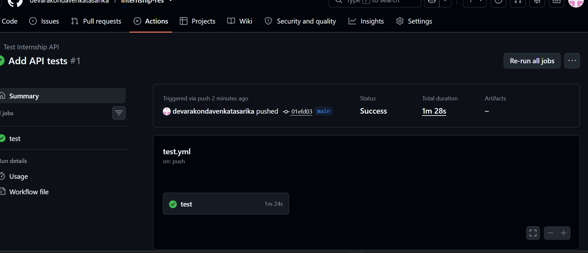

# Internship REST API

A REST API for managing internship records and applications using Node.js, Express.js and SQLite.

## Features

- Create internship records
- View internship records
- Pagination
- Filter internships by domain and mode
- Internship application submission
- Email validation
- Portfolio URL validation
- Duplicate application prevention
- SQLite persistent data storage

## Technologies

- Node.js
- Express.js
- SQLite
- better-sqlite3
- REST API
- JSON

## API Endpoints

### Get internships

GET `/api/internships`

### Pagination

GET `/api/internships?page=1&limit=5`

### Search internships

GET `/api/internships/search?domain=Cyber%20Security`

### Create internship

POST `/api/internships`

### Submit application

POST `/api/applications`

## How to Run

```bash
npm install
npm run seed
npm start
## Testing

The API was tested successfully using GitHub Actions.


